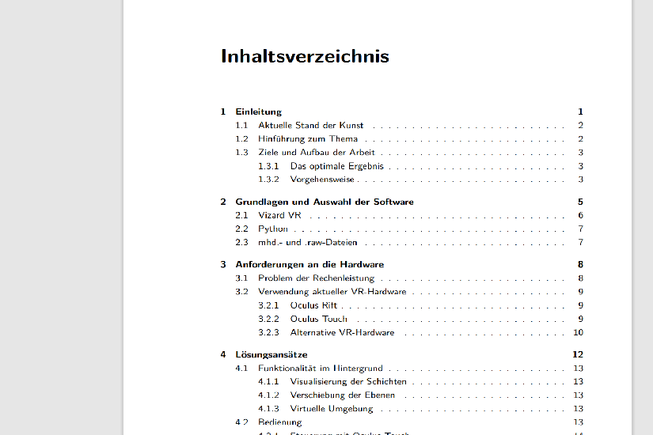

<h2>Bachelor-Arbeit:</h2> 
<H1>Verarbeitung medizinischer Daten in der VR</H1>
  

  
Komplette Arbeit (PDF) hier verfügbar: <a href="https://github.com/paalwie/BachelorMedizin/blob/main/arbeit.pdf">Klick</a>
  
Code-Schnipsel sind nur Beispiele und sollten in der Regel ohne passende Tools (Vizard, VR-Geräte, usw.) nicht funktionieren.
